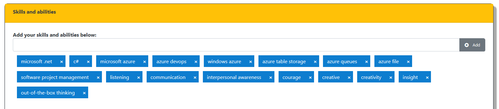

# jquery-crumbs
Crumbs display for a text field. 

The utility processes text entered in a textbox field, extracts pieces between commas (',') and creates 'crumbs' for each sub-string. Each of these crumbs has its own close button ('x'). Clicking it will remove the corresponding crumb from display. Behind the scenes, the script will also update an input field with the list of values -- comma-seperated.

So if you enter "hello,sunshine,world", you will get three crumbs: (hello X), (sunshine X) and (world X). The input field will be set to "hello,sunshine,world". The utility can also handle duplicate text input -- if you enter something that is already there, it will skip over it.

--------------------------------------------
## Screenshot

--------------------------------------------
## How to use

1. Download one of the `.js` files. Both are equivalent -- the `.min.js` file is the minified version of the other one. Also download the `.css` file (or the `.min.css`).
2. Ensure you have Jquery installed. When I wrote this code, I was using `jQuery v3.3.1`. You will need that one, or a newer version.
3. Create the "component" for your crumbs-enabled input area using the instructions below (see "Setting up the Component"), ensure you have used the CSS classes correctly.
4. Reference the `.css` and `.js` files and initialize the `crumbs` component with the `id` of what you set up in [3] above.
-------------------------------------------
## Setting up the Component

You need to set up 5 things to get the crumbs-enabled input experience going:

**1. User-input Textbox**:
This is where the user will type in the values to add to the values. Add an `input` to the screen, name and style it however you want. Attach the class `crumbs-input-user` to it. For example:

```
<input id="skillEntryField" type="text" class="form-control small crumbs-input-user" maxlength="255" />
```

**2. A button that the user will click**:
After entering the values in the above textbox, the user will click this button to get the script to process the entries and create the set of matching crumbs. You may use anything that supports a `click` event. Name and style it anything you want, attach the `crumbs-button-add` class to this element:

```
<button id="skillEntryAddButton" class="btn btn-secondary text-white crumbs-button-add" type="button">
    <span class="glyphicon glyphicon-plus-sign"></span>Add
</button>
```

**3. A container where the crumbs will display**:
This is simply a `div` (recommended, because we create `div`s for our crumbs!) with the style `crumbs-container`:

```
<div id="skillsList" class="crumbs-container small"></div>
```

**4. An input that will contain the final list of values**:
After the user has added/removed the set of items, you need someway to send those values server-side for storage or other processing. This is an `input` control whose value our script sets automatically with each add/remove. Just attach the class `crumbs-input-data` to it. I recommend a hidden-input, but the script does not care either way.

```
<input id="currentSkillsList" type="hidden" class="crumbs-input-data" value="" />
```

**5. Finally, a container to contain them all**:
You need a `div` that can contain all of the above created elements so that the script treats it as one. In fact, this is very important, because you tell the **Crumbs** script **only** about this `div` and nothing else -- it auto-discovers the other elements as **child** elements of this `div`. 

```
<div id="skills">
   <!-- The other 4 pieces -->
</div>
```

Here is the completed HTML, this creates the same component as seen in the screenshot above:
```
<div id="skills">
    <div class="input-group">
        <input id="skillEntryField" type="text" class="form-control small crumbs-input-user" maxlength="255" />
        <div class="input-group-append">
            <button id="skillEntryAddButton" class="btn btn-secondary text-white crumbs-button-add" type="button">
                <span class="glyphicon glyphicon-plus-sign"></span>Add
            </button>
        </div>
    </div>
    <div id="skillsList" class="crumbs-container small"></div>
    <input id="currentSkillsList" type="hidden" class="crumbs-input-data" value="" />
</div>
```

**NOTE**: Don't worry about the classes attached to the input and button fields. They do not exist in the CSS. They are **fake classes**, but are referenced in the JS file. If you are new to CSS and Javascript/Jquery, don't lose sleep over it, it is just how stuff works.

-------------------------------------------
## Hooking it up
Now attach the javascript and let the script do its magic. Simply call `crumbs.init` with the `id` of the `div` that contains all the sub-elements (the thing from step 5 above).

```
<!-- Don't forget to have this css-linkrel somewhere on that page! -->
<!-- link rel="stylesheet" type="text/css" href="crumbs.css" / -->

<script type="text/javascript" src="crumbs.js"></script>
<script type="text/javascript">
    crumbs.init( [ '#skills' ]  );
</script>
```

You may have any number of such components on the same page. You can hook them all up by adding the `id`s of the respective `div` containers in the same `crumbs.init` call. Here I am attaching three of them:

```
crumbs.init( [ '#skills', '#locations', '#roles' ]  );
```

-------------------------------------------
Questions? Comments? Feature Request? File an issue and let me know!
